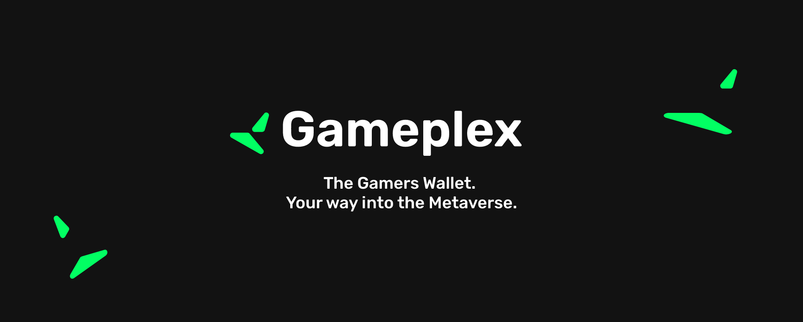
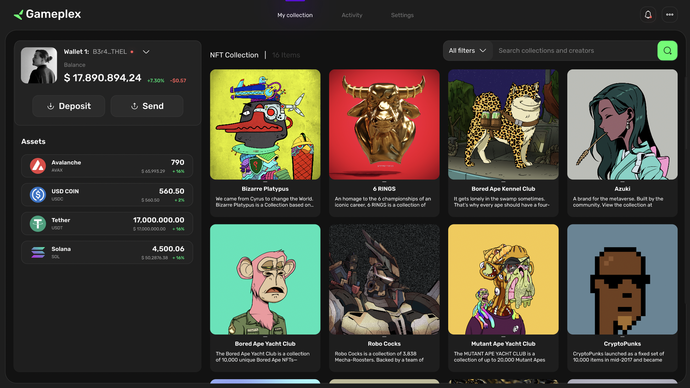

# Gameplex Wallet

<a href="https://62affb5a59a0afbdd86c13fc-csgyukwaaf.chromatic.com/?path=/story/example-introduction--page" target="_blank"></a>


A Gaming Community Focused wallet with integrations with Unity and Unreal Engine. Uses a Secure backend infrastraucture to communicate with any application.





## Getting started - Development

### Install Dependencies

```
# using yarn or npm
$ yarn (or `npm install`)

# using pnpm
$ pnpm install --shamefully-hoist
```

### Start

```
# development mode
$ npm run dev (or `yarn dev` or `pnpm run dev`)

# production build
$ npm run build (or `yarn build` or `pnpm run build`)
```
